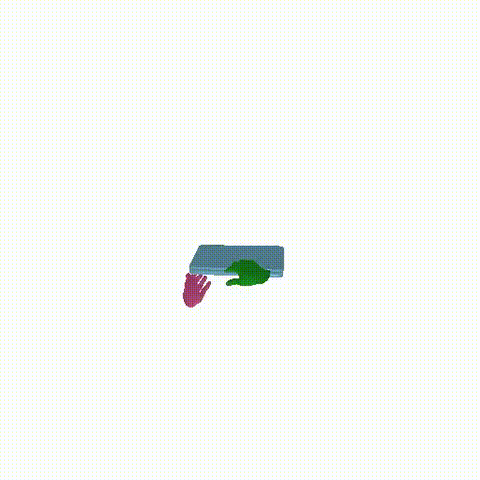

# DivideMotion: Dual-Stream Conditional Diffusion for Text-to-3D Hand–Object Interaction

> **One‑liner**: Diffusion-based Transformer model for generating 3D hand–object interaction motions from natural language descriptions.


---

## 🧭 Table of contents


* [Model architecture](#-model-architecture)
* [Quickstart](#-quickstart)
* [Installation](#-installation)
* [Demo](#-Results)
* [Data](#-data)
* [Training](#-training)
* [Evaluation](#-evaluation)
* [Results](#-results)
* [Project structure](#-project-structure)
* [Roadmap](#-roadmap)
* [Status](#-status)
* [Acknowledgments](#-Acknowledgments)


## 🧱 Model architecture


---

## 🚀 Quickstart
----
```bash
# Clone and enter the folder
git clone https://github.com/anonym3dv/HOI-generation.git && cd HOI-generation

```

## 🛠️ Installation


```bash
source scripts/install.sh
```

------


## 🎬 Results

> **Qualitative results — DivideMotion.**  
> The four clips illustrate the model’s output diversity for the same text prompt: variations in execution **style** , **tempo** , **trajectory**  and **finger articulation**.  


| [](assets/demo1.mp4) | [](assets/demo2.mp4) | [](assets/demo3.mp4) | [](assets/demo4.mp4) |
|---|---|---|---|


---

## 📂 Data

Follow the exact data protocols of [Text2HOI](https://github.com/JunukCha/Text2HOI/tree/main).

Folder structure and preprocessing identical to the official repo.

We do not redistribute datasets — obtain them from their official sources and respect their licenses.

This project expects the same preprocessed files Text2HOI.


---

## 🏋️ Training Text-HOI Model

```bash
source scripts/train/train_texthoi.sh
```

or Download the pre-trained **[DivideMotion](<MODEL_LINK>)** and place it in checkpoint folder

---

## 📊 Evaluation & Training — Text–Motion Match

**Generate evaluation data (20× per prompt)**

```bash
python Evaluation/evaluation_data_generation.py
```

**Download the pretrained model**: [text–motion matching model](MODEL_LINK) → place it in `<PATH_TO_MODEL_DIR>`.

**Evaluation (run from the Text–Motion Match folder)**

```bash
python eval.py \
  --model_dir <PATH_TO_MODEL_DIR> \
  --log_file <PATH_TO_LOG_FILE> \
  --device_id <GPU_ID> \
  --data_root <PATH_TO_DATA_DIR>
```

**When training, ensure:** `--dim_pose = x_lhand + x_rhand + x_obj`.

**Training — GRAB**

```bash
python train.py \
  --dataset_name grab \
  --gpu_id 0 \
  --batch_size 64 \
  --dim_pose 207 \
  --dim_motion_latent 512 \
  --num_layers 6 \
  --num_heads 8 \
  --dropout 0.1
```

**Training — ARCTIC**

```bash
python train.py \
  --dataset_name arctic \
  --gpu_id 0 \
  --batch_size 64 \
  --dim_pose 208 \
  --dim_motion_latent 512 \
  --num_layers 6 \
  --num_heads 8 \
  --dropout 0.1
```

---


## 🗺️ Roadmap

* [ ] Release the training code
* [ ] text-motion checkpoints


## 🚧 Status

This repository is **under active construction**. Interfaces, training scripts, and docs may change frequently.

If you run into errors or have questions, please **open an issue** .

We appreciate your feedback — it helps us prioritize fixes and improvements.

---
## 🙏 Acknowledgments

This project is **inspired** by [Text2HOI](https://github.com/JunukCha/Text2HOI) (Cha et al., 2024).  
We follow their data protocols and some implementations.  


---
